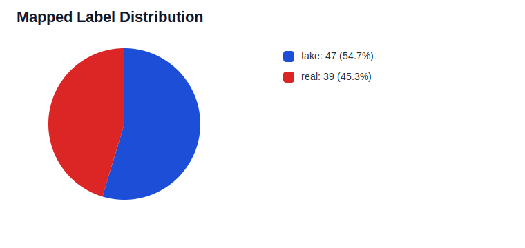
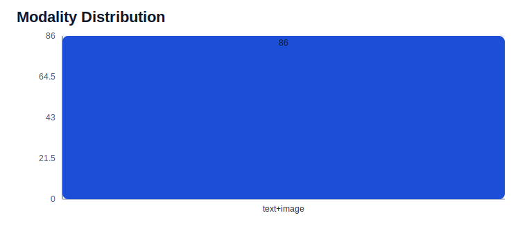
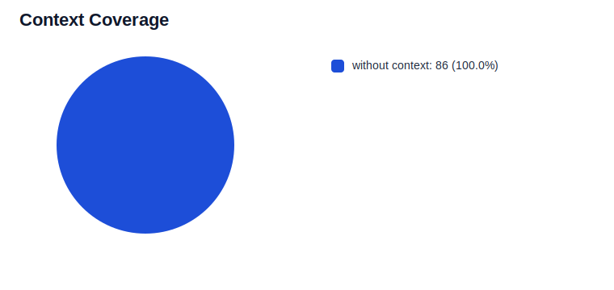
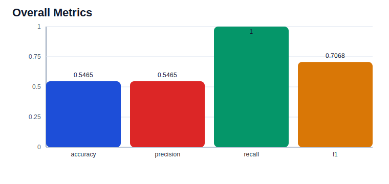

# fakeddit Visualization Report

This file explains the generated visualization artifacts for the current run and summarizes the main pattern visible in each chart.

## Mapped Label Distribution

**What this visual is:** A pie chart showing how many cleaned samples map to each binary target label.

**Where it came from:** Derived from `dataset_summary.json -> label_types.mapped_labels` after cleaning and any optional balanced sampling.

**Trend seen:** The label mix is relatively balanced, with `fake` only slightly ahead of `real`.

## Modality Distribution

**What this visual is:** A bar chart showing the count of text-only versus multimodal records that survived cleaning.

**Where it came from:** Derived from `dataset_summary.json -> modality_distribution`, using the normalized records written by the pipeline.

**Trend seen:** All observed modality values fell into `text+image`.

## Context Coverage

**What this visual is:** A pie chart comparing records that include context text with records that do not.

**Where it came from:** Derived from `dataset_summary.json -> records_with_context` and `sample_count`.

**Trend seen:** `without context` dominates the context coverage mix at 100.0%, well above `with context` by 86.0.

## Overall Metrics

**What this visual is:** A bar chart comparing the top-line evaluation metrics for the current run.

**Where it came from:** Derived from `evaluation_report.json -> overall` after prediction and scoring.

**Trend seen:** `recall` is the strongest metric at 1.000, while `precision` is the main constraint at 0.546.
