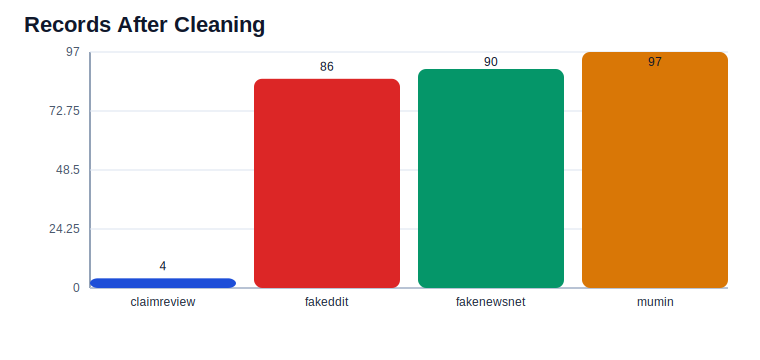
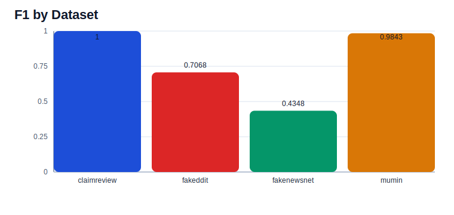
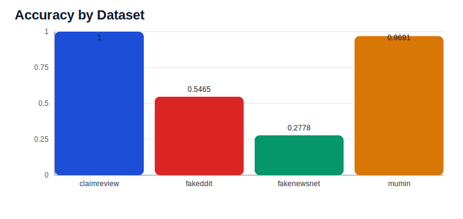
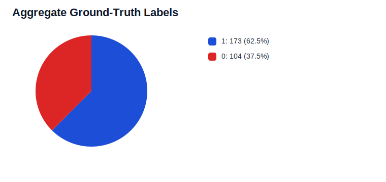

# Visualisation Guide

This page brings generated experiment visuals into the project documentation so they can be reviewed from the docs folder rather than only from an artifact directory.

The checked-in visuals currently point at an archived pilot run under `artifacts/pilot_run/visualizations/`. Those assets are still useful as an example of the reporting surface, but they predate the current Hugging Face-first workflow.

## Archived Source Run

The archived visuals were generated from:

```bash
python3 src/run_experiment.py \
  --dataset all \
  --balanced \
  --limit 100 \
  --mode huggingface \
  --output-dir artifacts/pilot_run
```

If you want the docs to represent a newer run, rerun the command above with the model and context settings you want, then refresh the linked assets in this page.

Open the full dashboard here:

- [Aggregate dashboard](../artifacts/pilot_run/visualizations/dashboard.html)

## Records After Cleaning



**What this visual is:** A bar chart comparing how many records remained in each dataset after cleaning and optional balancing.

**Where it came from:** Derived from `artifacts/pilot_run/aggregate_summary.json -> per_dataset[].records_after_cleaning`.

**Trend seen:** MuMiN and FakeNewsNet contribute the largest retained slices in the current aggregate run, while ClaimReview remains much smaller because the local feed sample is tiny by comparison.

## F1 by Dataset



**What this visual is:** A bar chart comparing the final F1 score achieved on each dataset that ran successfully.

**Where it came from:** Derived from `artifacts/pilot_run/aggregate_summary.json -> per_dataset[].f1`.

**Trend seen in the archived pilot:** ClaimReview and MuMiN sit at the top of the current F1 ranking, while FakeNewsNet is the hardest dataset in that snapshot and Fakeddit lands in the middle.

## Accuracy by Dataset



**What this visual is:** A bar chart comparing overall accuracy across datasets.

**Where it came from:** Derived from `artifacts/pilot_run/aggregate_summary.json -> per_dataset[].accuracy`.

**Trend seen in the archived pilot:** Accuracy follows the same pattern as F1: ClaimReview and MuMiN are strongest in this run, Fakeddit is moderate, and FakeNewsNet is the weakest slice in that snapshot.

## Aggregate Ground-Truth Labels



**What this visual is:** A pie chart showing the combined label mix across all datasets included in the aggregate run.

**Where it came from:** Derived from `artifacts/pilot_run/aggregate_evaluation.json -> label_distribution.ground_truth`.

**Trend seen in the archived pilot:** The combined label pool is still skewed toward the `1` label in the current run, which helps explain why false-positive pressure remains an important metric to watch.

## How To Refresh

1. Re-run the aggregate pipeline command above with the model and context settings you want represented.
2. Re-open this page.
3. If you want a different experiment represented here, update the image links to point at that run's `visualizations/` folder.
